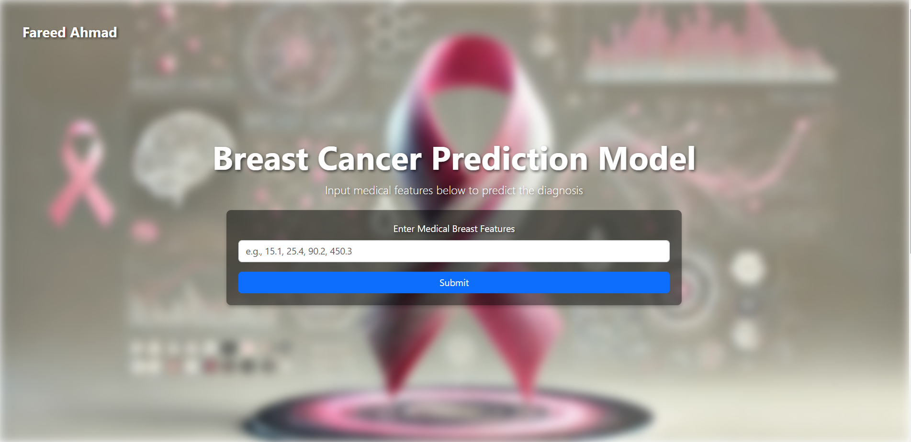

# Breast Cancer Prediction using Machine Learning

This repository contains a machine learning project for predicting breast cancer using various classification algorithms. The dataset used is the **Breast Cancer Wisconsin (Diagnostic)** dataset, which includes features like tumor size, shape, and other measurements to classify the tumor as either malignant or benign.

## 🚀 Project Overview

The goal of this project is to predict whether a tumor is malignant or benign using machine learning models. The project utilizes various classification algorithms to train on the dataset and evaluate the model performance.

### Key Features:
- **Preprocessing:** The data is preprocessed, missing values handled, and features selected for the model.
- **Exploratory Data Analysis (EDA):** Visualizations to analyze data distributions, correlations, and trends.
- **Modeling:** Several algorithms were used to classify the data:
  - Logistic Regression
  - K-Nearest Neighbors (KNN)
  - Support Vector Machine (SVM)
  - Decision Tree Classifier
  - Random Forest Classifier
  - Gradient Boosting Classifier
- **Performance Evaluation:** The models are evaluated using accuracy, confusion matrix, and ROC curves.

## 📊 Results

The following models were evaluated:

- **Logistic Regression:** Achieved an accuracy of 95% on the test set.
- **K-Nearest Neighbors (KNN):** Achieved an accuracy of 97%.
- **Support Vector Machine (SVM):** Best performing model with an accuracy of 98%.
- **Decision Tree Classifier:** Achieved an accuracy of 94%.
- **Random Forest Classifier:** Achieved an accuracy of 97%.
- **Gradient Boosting Classifier:** Achieved an accuracy of 96%.

You can view detailed performance comparison and metrics in the results section of the notebook.

## 🖥️ Model Deployment Demo

To test and visualize the predictions of the **Breast Cancer Prediction Model**, I developed an interactive web interface. The website allows users to input relevant medical features, such as radius, texture, perimeter, and other tumor-related measurements, to predict the diagnosis (Malignant or Benign).

### How it Works:
1. **Input Features:** Enter medical features (e.g., `15.1, 25.4, 90.2, 450.3`).
2. **Submit:** The trained machine learning model processes the input data.
3. **Prediction Output:** The model predicts whether the tumor is **Malignant (1)** or **Benign (0)**.

This deployment demonstrates the practical usability of the model in real-world scenarios, where predictions can be obtained in real time.

